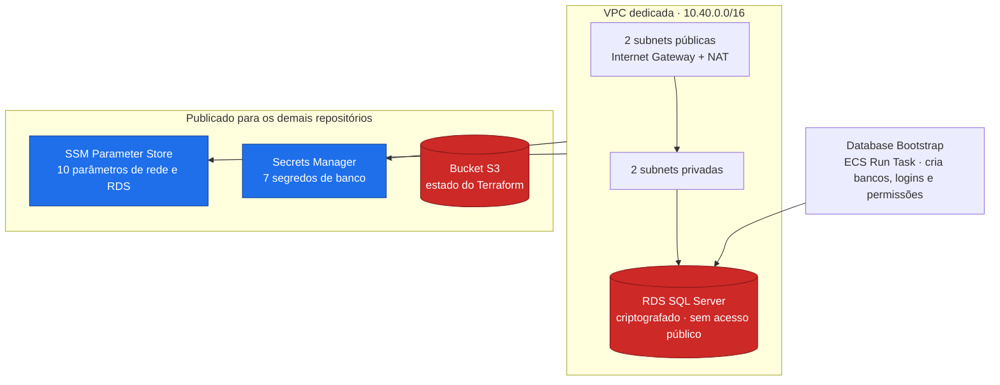

# oficina-infra-db

Fundação da solução **Oficina**: rede, banco de dados relacional, segredos de acesso e o estado remoto do Terraform compartilhado por toda a solução.


---

## Sumário

- [Visão geral](#visão-geral)
- [Ordem de deploy da solução](#ordem-de-deploy-da-solução)
- [Arquitetura](#arquitetura)
- [O que consome e o que publica](#o-que-consome-e-o-que-publica)
- [Configuração](#configuração)
- [Como executar](#como-executar)
- [Validação](#validação)
- [Execução local](#execução-local)
- [Limitações conhecidas](#limitações-conhecidas)
- [Próxima etapa](#próxima-etapa)

---

## Visão geral

A **Oficina** é uma plataforma de gestão de oficina mecânica implantada na AWS e distribuída em **6 repositórios** que compõem um único sistema. O cliente acessa uma **API Gateway HTTP**, que autentica na borda por uma **Lambda authorizer** e encaminha o tráfego, via **VPC Link**, para um **ALB interno** que roteia para três microsserviços **.NET 10 em ECS Fargate**. Os serviços se comunicam por HTTP interno e por filas **SQS FIFO**, e persistem em um **RDS SQL Server** compartilhado.

| Repositório | Responsabilidade | Etapas |
|---|---|:---:|
| **oficina-infra-db** *(este)* | Rede, banco de dados, segredos e estado do Terraform | 1 e 3 |
| [oficina-infra](https://github.com/fabianorodrigues/oficina-infra-fiap-fase4) | Plataforma ECS/ALB e entrada de API | 2, 6 e 7 |
| [oficina-auth-lambda](https://github.com/fabianorodrigues/oficina-auth-lambda-fiap-fase4) | Autenticação por CPF e validação de token | 4 |
| [oficina-cadastro](https://github.com/fabianorodrigues/oficina-cadastro-fiap-fase4) | Clientes, veículos, funcionários e catálogo de serviços | 5 |
| [oficina-estoque](https://github.com/fabianorodrigues/oficina-estoque-fiap-fase4) | Peças, insumos, saldos e reservas | 5 |
| [oficina-ordens-servico](https://github.com/fabianorodrigues/oficina-ordens-servico-fiap-fase4) | Ordens de serviço, orçamento e saga de pagamento | 5 e 8 |

**Papel deste repositório:** é a raiz da solução. Provisiona a rede (VPC), o banco (RDS SQL Server), os contêineres de segredo do banco e o bucket S3 que armazena o **estado do Terraform de todos os stacks**. Nada é implantado sem que esta etapa exista.

---

## Ordem de deploy da solução

Os repositórios têm dependências reais entre si. Esta é a sequência obrigatória — cada workflow valida suas precondições e falha se a etapa anterior não estiver concluída.

| # | Repositório | Workflow | Confirmação |
|:---:|---|---|:---:|
| **1** | **oficina-infra-db** | **Database Infrastructure Deploy** | `APPLY` |
| 2 | oficina-infra | Platform Deploy | `APPLY` |
| **3** | **oficina-infra-db** | **Database Bootstrap** | `BOOTSTRAP` |
| 4 | oficina-auth-lambda | Auth Deploy | `DEPLOY` |
| 5 | cadastro · estoque · ordens-servico | Deploy | `DEPLOY` |
| 6 | oficina-infra | Entrypoint Deploy | `APPLY` |
| 7 | oficina-infra | Observability Validate | — |
| 8 | oficina-ordens-servico | AWS E2E Validate | `VALIDATE` |

> [!IMPORTANT]
> **Este repositório abre e retoma a sequência.** A **etapa 1** cria o bucket S3 de estado usado por todos os stacks — sem ela, os deploys de plataforma, autenticação e entrada abortam na verificação do bucket. A **etapa 3** (bootstrap) roda como *ECS Run Task* e depende do cluster ECS e do repositório de imagem criados na etapa 2, por isso não é adjacente à etapa 1.

---

## Arquitetura



O acoplamento entre repositórios é feito **por nome de parâmetro no SSM e no Secrets Manager**. Não há leitura de estado entre stacks: cada stack lê apenas o que o anterior publicou.

---

## O que consome e o que publica

### Consome

Nada. Este repositório é a raiz do grafo de dependências. O **Database Bootstrap** (etapa 3) é a única exceção: consome o cluster ECS, o grupo de segurança das tasks e o repositório de imagem `db-bootstrap` publicados pela plataforma na etapa 2.

### Publica

| Recurso | Caminho | Consumido por |
|---|---|---|
| VPC | `/oficina/infra/vpc/id` | infra, auth |
| Subnets privadas | `/oficina/infra/subnets/private/{1,2}` | infra, auth |
| Subnets públicas | `/oficina/infra/subnets/public/{1,2}` | infra |
| RDS | `/oficina/infra/rds/{identifier,endpoint,port}` | bootstrap |
| Grupo de segurança do RDS | `/oficina/infra/rds/security-group-id` | infra, auth |
| Segredo master do RDS | `/oficina/infra/rds/master-secret-arn` | bootstrap |
| Credenciais dos serviços | `/oficina/{cadastro,estoque,ordens}/{runtime,migration}-db` | cadastro, estoque, ordens |
| Credencial de leitura da autenticação | `/oficina/auth/database` | auth |
| Estado do Terraform | Bucket S3 `oficina-terraform-state-<conta>-<região>` | infra, auth |

### Matriz de bancos e logins

Criada pelo **Database Bootstrap** (etapa 3):

| Banco | Login de runtime | Login de migração | Somente leitura |
|---|---|---|---|
| `OficinaCadastroDb` | `cadastro_app` | `cadastro_migrator` | `auth_read` |
| `OficinaEstoqueDb` | `estoque_app` | `estoque_migrator` | — |
| `OficinaOrdensServicoDb` | `ordens_app` | `ordens_migrator` | — |

O login `auth_read` permite que a autenticação consulte a tabela de funcionários sem receber permissão de escrita.

---

## Configuração

Configure em **Settings → Secrets and variables → Actions** do repositório.

### Secrets

| Secret | Uso | Obrigatório |
|---|---|:---:|
| `AWS_ACCESS_KEY_ID` · `AWS_SECRET_ACCESS_KEY` · `AWS_SESSION_TOKEN` | Credenciais temporárias da AWS | **Sim** |
| `SQL_CADASTRO_APP_PASSWORD` · `SQL_CADASTRO_MIGRATOR_PASSWORD` | Senhas dos logins do banco de cadastro | **Sim** |
| `SQL_ESTOQUE_APP_PASSWORD` · `SQL_ESTOQUE_MIGRATOR_PASSWORD` | Senhas dos logins do banco de estoque | **Sim** |
| `SQL_ORDENS_APP_PASSWORD` · `SQL_ORDENS_MIGRATOR_PASSWORD` | Senhas dos logins do banco de ordens | **Sim** |
| `SQL_AUTH_READ_PASSWORD` | Senha do login de leitura da autenticação | **Sim** |
| `RDS_ADMIN_CIDR` | CIDR IPv4 (`/32`) autorizado a acessar a porta 1433 para administração via SSMS. Vazio mantém o RDS fechado | Não |

O deploy verifica a presença das 7 senhas antes de iniciar e falha listando as que faltarem. Use senhas que atendam à política do SQL Server (maiúscula, minúscula, dígito e no mínimo 8 caracteres).

### Variables

| Variable | Uso | Obrigatório |
|---|---|:---:|
| `AWS_REGION` | Região de todos os recursos | **Sim** |
| `SQL_TOOLS_IMAGE` | Imagem base com as ferramentas de linha de comando do SQL Server, usada pelo bootstrap. Exige tag ou digest explícito — `latest` é rejeitado | **Sim, para o bootstrap** |
| `ECS_TASK_EXECUTION_ROLE_ARN` | Role de execução da task de bootstrap | **Sim, para o bootstrap** |
| `ECS_TASK_ROLE_ARN` | Role de aplicação da task de bootstrap | **Sim, para o bootstrap** |
| `TF_STATE_BUCKET` | Compatibilidade com um bucket de estado pré-existente | Não |

### Papéis IAM das tasks ECS — não provisionados automaticamente

O **Database Bootstrap** roda como task ECS Fargate e reutiliza duas roles IAM que **precisam existir antes da execução**. Nenhum workflow da solução cria essas roles. Configure `ECS_TASK_EXECUTION_ROLE_ARN` e `ECS_TASK_ROLE_ARN` como *Repository Variables* apontando para roles com:

| Variable | Trust | Permissões mínimas |
|---|---|---|
| `ECS_TASK_EXECUTION_ROLE_ARN` | `ecs-tasks.amazonaws.com` | `AmazonECSTaskExecutionRolePolicy` (pull no ECR e escrita de logs) e `secretsmanager:GetSecretValue` no segredo master do RDS e nos 7 segredos de banco |
| `ECS_TASK_ROLE_ARN` | `ecs-tasks.amazonaws.com` | Nenhuma permissão específica é exigida pelo bootstrap; use uma role mínima com o trust correto |

> [!NOTE]
> Essas duas variáveis são **as mesmas** usadas pelos deploys de cadastro, estoque e ordens. Crie o par de roles uma vez e reutilize nos quatro repositórios que executam tasks ECS.

Consulte o ARN de uma role existente com:

```powershell
aws iam get-role --role-name "<ROLE_NAME>" --query "Role.Arn" --output text
```

### O que é provisionado automaticamente

O bucket de estado é criado e reconciliado pelo próprio workflow, e **todas as variáveis do Terraform têm valor padrão** — não é necessário criar recursos de rede ou banco manualmente.

> [!WARNING]
> O CIDR da VPC (`10.40.0.0/16`), a engine, a classe de instância e o armazenamento do RDS são **fixos no código Terraform**. Não há *variables* do GitHub para alterá-los: mudanças exigem editar `terraform/infra-db/variables.tf` e abrir um pull request. A única variável Terraform sem valor padrão é a região, preenchida por `AWS_REGION`. A secret opcional `RDS_ADMIN_CIDR` não altera a rede; apenas adiciona uma exceção de entrada no grupo de segurança do RDS.

---

## Como executar

Ambos os workflows rodam apenas na branch `main`, exigem uma confirmação **sensível a maiúsculas** e não podem ser executados em paralelo consigo mesmos.

### Etapa 1 — Database Infrastructure Deploy

**Actions → Database Infrastructure Deploy → Run workflow → `confirmation` = `APPLY`**

Cria e reconcilia o bucket de estado → valida o plano do Terraform → aplica a rede, o RDS e os contêineres de segredo → grava as 7 senhas no Secrets Manager → revalida. Um passo de segurança **interrompe o deploy se o plano previr exclusão** de VPC, subnet, instância de banco, segredo ou parâmetro.

Duração típica: 15 a 25 minutos, dominada pela criação do RDS.

### Etapa 3 — Database Bootstrap

Execute **apenas depois** do Platform Deploy (etapa 2), pois roda como task ECS Fargate no cluster criado por ele.

**Actions → Database Bootstrap → Run workflow → `confirmation` = `BOOTSTRAP`**

Constrói a imagem de bootstrap a partir de `SQL_TOOLS_IMAGE`, publica no ECR `db-bootstrap`, registra a *task definition*, executa `aws ecs run-task` em subnets privadas, aguarda a task encerrar e valida o código de saída. Cria os bancos, os logins e as permissões da matriz acima. É idempotente — reexecutar não duplica objetos. As senhas são injetadas como *secrets* da task e não aparecem nos logs.

---

## Validação

### Pelo Console AWS

| Serviço | O que verificar |
|---|---|
| **VPC** | 1 VPC, 4 subnets, 1 Internet Gateway, 1 NAT Gateway |
| **RDS** | Instância `Available`, **Publicly accessible = No**, criptografia habilitada |
| **Secrets Manager** | 7 segredos, cada um com uma versão `AWSCURRENT` |
| **Parameter Store** | 10 parâmetros sob `/oficina/infra/` |
| **S3** | Bucket de estado com versionamento e criptografia ativos |
| **ECS → Tasks (após a etapa 3)** | Task `oficina-db-bootstrap` encerrada com código de saída 0 |

### Pela AWS CLI

<details>
<summary>Comandos de validação</summary>

```bash
REGIAO=<sua-regiao>

# Parâmetros publicados para os demais repositórios
aws ssm get-parameters-by-path --path /oficina/infra --recursive \
  --region "$REGIAO" --query 'Parameters[].Name' --output table

# RDS disponível e fechado para a internet
aws rds describe-db-instances --region "$REGIAO" \
  --query 'DBInstances[].{Status:DBInstanceStatus,Publico:PubliclyAccessible,Cripto:StorageEncrypted}' \
  --output table

# Cada segredo deve ter exatamente uma versão corrente
for s in cadastro/runtime-db cadastro/migration-db estoque/runtime-db \
         estoque/migration-db ordens/runtime-db ordens/migration-db auth/database; do
  echo -n "/oficina/$s -> "
  aws secretsmanager describe-secret --secret-id "/oficina/$s" \
    --region "$REGIAO" --query 'length(VersionIdsToStages)' --output text
done
```

</details>

O resumo da execução do bootstrap lista os bancos, logins e permissões aplicados, sem expor credenciais.

---

## Execução local

Este repositório não provisiona recursos localmente: toda alteração é aplicada pelos workflows, para manter o estado do Terraform consistente. Localmente é possível reproduzir a validação estática da CI:

```bash
cd terraform/infra-db
terraform fmt -check -recursive
terraform init -backend=false
terraform validate
```

---

## Limitações conhecidas

- **RDS de instância única**, single-AZ, sem alta disponibilidade e com 1 dia de retenção de backup — dimensionado para ambiente acadêmico.
- **NAT Gateway único** para as duas subnets privadas: ponto único de falha na saída.
- **Sem monitoramento avançado do banco** (Performance Insights, alarmes, exportação de logs).
- **Credenciais estáticas** com token de sessão, em vez de federação OIDC.

---

## Próxima etapa

Com a rede, o banco e o bucket de estado disponíveis, prossiga para a etapa 2:

**→ [oficina-infra](https://github.com/fabianorodrigues/oficina-infra-fiap-fase4)** — provisiona o cluster ECS, o ALB interno, os repositórios de imagem e as filas.

Concluída a etapa 2, **retorne aqui** para executar o **Database Bootstrap** (etapa 3).
