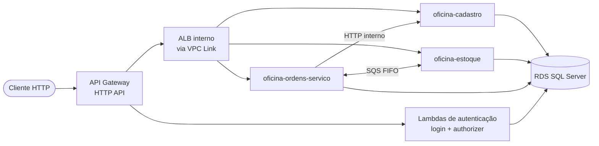
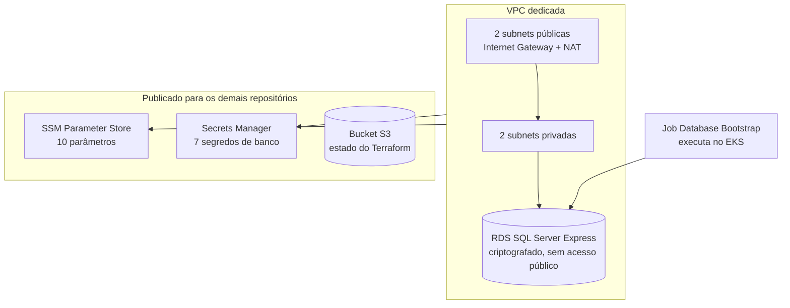

# oficina-infra-db

> Fundação da solução Oficina: rede, banco de dados relacional e segredos de acesso.
> **Terraform** · **AWS** (VPC, RDS SQL Server, Secrets Manager, SSM) · **GitHub Actions**

---

## A solução

A **Oficina** é uma plataforma de gestão de oficina mecânica distribuída em **6 repositórios** que compõem um único sistema na AWS. O cliente acessa uma API Gateway que autentica na borda e encaminha o tráfego para três microsserviços .NET 10 em EKS, que se comunicam por HTTP e por filas SQS FIFO e persistem em um RDS SQL Server compartilhado.



| Repositório | Responsabilidade |
|---|---|
| **oficina-infra-db** *(este)* | Rede, banco de dados, segredos e estado do Terraform |
| [oficina-infra](https://github.com/fabianorodrigues/oficina-infra-fiap-fase4) | Plataforma EKS e entrypoint de API |
| [oficina-auth-lambda](https://github.com/fabianorodrigues/oficina-auth-lambda-fiap-fase4) | Autenticação por CPF e emissão de token |
| [oficina-cadastro](https://github.com/fabianorodrigues/oficina-cadastro-fiap-fase4) | Clientes, veículos, funcionários e catálogo de serviços |
| [oficina-estoque](https://github.com/fabianorodrigues/oficina-estoque-fiap-fase4) | Peças, insumos, saldos e reservas |
| [oficina-ordens-servico](https://github.com/fabianorodrigues/oficina-ordens-servico-fiap-fase4) | Ordens de serviço, orçamento e saga de pagamento |

---

## Ordem de deploy

Os repositórios têm dependências reais entre si. Esta é a sequência obrigatória — cada workflow valida suas precondições e falha se a etapa anterior não tiver sido concluída.

| # | Repositório | Workflow | Confirmação |
|---|---|---|---|
| **1** | **oficina-infra-db** | **Database Infrastructure Deploy** | `APPLY` |
| 2 | oficina-infra | Platform Deploy | `APPLY` |
| **3** | **oficina-infra-db** | **Database Bootstrap** | `BOOTSTRAP` |
| 4 | oficina-auth-lambda | Auth Deploy | `DEPLOY` |
| 5 | cadastro · estoque · ordens-servico | Deploy | `DEPLOY` |
| 6 | oficina-infra | Entrypoint Deploy | `APPLY` |
| 7 | oficina-infra | Observability Validate | `VALIDATE` |
| 8 | oficina-ordens-servico | AWS E2E Validate | `VALIDATE` |

> **Este repositório abre e retoma a sequência.** A etapa 1 cria o bucket S3 que armazena o estado do Terraform de **todos** os stacks da solução — sem ela, os deploys de plataforma, entrypoint e autenticação abortam na verificação do bucket. A etapa 3 depende do cluster EKS criado na etapa 2, por isso não é adjacente à etapa 1.

---

## Responsabilidade

Este repositório provisiona a camada de dados e a fundação de estado:

- **Rede** — VPC dedicada, 2 subnets públicas e 2 privadas em zonas distintas, Internet Gateway e um NAT Gateway. As subnets recebem as tags que o EKS e o balanceador exigem para descoberta automática.
- **Banco de dados** — instância RDS SQL Server Express, criptografada, sem acesso público, com a senha do usuário master gerenciada pelo próprio RDS.
- **Segredos** — 7 contêineres no Secrets Manager (um par de credenciais por serviço, mais um leitor para a autenticação), preenchidos a partir das senhas configuradas no GitHub.
- **Estado do Terraform** — bucket S3 versionado, criptografado, com bloqueio de acesso público e política que exige TLS.
- **Bootstrap dos bancos** — Job no EKS que cria os bancos lógicos, os logins e as permissões.

---

## Arquitetura



O acoplamento entre repositórios é feito **por nome de parâmetro no SSM e no Secrets Manager**. Não há leitura de estado entre stacks: cada stack lê apenas o que o anterior publicou.

---

## Contrato de integração

### Publica

| Recurso | Caminho | Consumido por |
|---|---|---|
| VPC | `/oficina/infra/vpc/id` | infra (plataforma e entrypoint), auth |
| Subnets privadas | `/oficina/infra/subnets/private/{1,2}` | infra, auth |
| Subnets públicas | `/oficina/infra/subnets/public/{1,2}` | infra |
| RDS | `/oficina/infra/rds/{identifier,endpoint,port}` | bootstrap deste repositório |
| Grupo de segurança do RDS | `/oficina/infra/rds/security-group-id` | infra, auth |
| Segredo master do RDS | `/oficina/infra/rds/master-secret-arn` | infra, bootstrap |
| Credenciais dos serviços | `/oficina/{cadastro,estoque,ordens}/{runtime,migration}-db` | cadastro, estoque, ordens |
| Credencial de leitura da autenticação | `/oficina/auth/database` | auth |
| Estado do Terraform | Bucket S3 derivado da conta e da região | infra, auth |

### Consome

Nada. Este repositório é a raiz do grafo de dependências.

### Matriz de bancos e logins

| Banco | Login de runtime | Login de migração | Somente leitura |
|---|---|---|---|
| `OficinaCadastroDb` | `cadastro_app` | `cadastro_migrator` | `auth_read` |
| `OficinaEstoqueDb` | `estoque_app` | `estoque_migrator` | — |
| `OficinaOrdensServicoDb` | `ordens_app` | `ordens_migrator` | — |

O login `auth_read` existe para que a autenticação consulte os funcionários sem receber permissão de escrita.

---

## Configuração

Configure em **Settings → Secrets and variables → Actions** do repositório.

### Secrets (obrigatórios)

| Secret | Uso |
|---|---|
| `AWS_ACCESS_KEY_ID` · `AWS_SECRET_ACCESS_KEY` · `AWS_SESSION_TOKEN` | Credenciais temporárias da AWS |
| `SQL_CADASTRO_APP_PASSWORD` · `SQL_CADASTRO_MIGRATOR_PASSWORD` | Senhas dos logins do banco de cadastro |
| `SQL_ESTOQUE_APP_PASSWORD` · `SQL_ESTOQUE_MIGRATOR_PASSWORD` | Senhas dos logins do banco de estoque |
| `SQL_ORDENS_APP_PASSWORD` · `SQL_ORDENS_MIGRATOR_PASSWORD` | Senhas dos logins do banco de ordens |
| `SQL_AUTH_READ_PASSWORD` | Senha do login de leitura da autenticação |

O deploy verifica a presença das 7 senhas antes de iniciar e falha listando as que faltarem. Use senhas que atendam à política do SQL Server (maiúscula, minúscula, dígito e no mínimo 8 caracteres).

### Secret opcional para administração

| Secret | Uso |
|---|---|
| `RDS_ADMIN_CIDR` | CIDR IPv4 autorizado a acessar a porta 1433 do SQL Server para administração via SSMS. Use preferencialmente um `/32`, por exemplo `203.0.113.10/32`. Vazio mantém o acesso administrativo fechado. |

Para descobrir o seu IP público atual, montar o CIDR `/32` e configurar a secret no repositório com GitHub CLI:

```powershell
$publicIp = (Invoke-RestMethod -Uri "https://checkip.amazonaws.com").Trim()
$rdsAdminCidr = "$publicIp/32"

gh secret set RDS_ADMIN_CIDR --body $rdsAdminCidr
```

Para confirmar que a secret foi cadastrada:

```powershell
gh secret list | Select-String '^RDS_ADMIN_CIDR\s'
```


### Variables

| Variable | Obrigatória | Uso |
|---|---|---|
| `AWS_REGION` | **Sim** | Região de todos os recursos |
| `SQL_TOOLS_IMAGE` | **Sim, para o Database Bootstrap** | Imagem com as ferramentas de linha de comando do SQL Server. Exige tag explícita — a tag móvel `latest` é rejeitada |
| `TF_STATE_BUCKET` | Não | Apenas compatibilidade com um bucket de estado pré-existente |

### O que é provisionado automaticamente

Não é necessário criar nada na AWS manualmente. O bucket de estado é criado e reconciliado pelo próprio workflow, e **todos os parâmetros de infraestrutura têm valor padrão no Terraform**.

> **Atenção:** CIDR da VPC, engine, classe de instância, tipo e tamanho de armazenamento do RDS são **fixos no código Terraform**. Não existem variables do GitHub para alterá-los — mudar esses valores exige editar `terraform/infra-db/variables.tf` e abrir um pull request. A única variável Terraform sem valor padrão é a região, preenchida a partir de `AWS_REGION`. A secret opcional `RDS_ADMIN_CIDR` não muda o CIDR da VPC; ela apenas adiciona uma exceção de entrada no security group do RDS.

---

## Executar pelo GitHub Actions

Ambos os workflows rodam apenas na branch `main`, exigem uma string de confirmação **sensível a maiúsculas** e não podem ser executados em paralelo consigo mesmos.

### 1. Database Infrastructure Deploy — etapa 1

**Actions → Database Infrastructure Deploy → Run workflow → `confirmation` = `APPLY`**

Executa, em ordem: cria e reconcilia o bucket de estado → valida o plano do Terraform → aplica a rede, o RDS e os contêineres de segredo → grava as 7 senhas no Secrets Manager → revalida. Um passo de segurança **interrompe o deploy se o plano previr exclusão** de VPC, subnet, instância de banco, segredo ou parâmetro.

Duração típica: 15 a 25 minutos, dominada pela criação do RDS.

### 2. Database Bootstrap — etapa 3

Execute **apenas depois** do Platform Deploy, pois roda como Job dentro do cluster EKS.

**Actions → Database Bootstrap → Run workflow → `confirmation` = `BOOTSTRAP`**

Cria os bancos lógicos, os logins e as permissões da matriz acima. É idempotente: reexecutar não duplica objetos. Os logs passam por um filtro que aborta o passo caso detecte vazamento de credencial.

---

## Validar

### Pelo Console AWS

| Serviço | O que verificar |
|---|---|
| **VPC** | 1 VPC, 4 subnets, 1 Internet Gateway, 1 NAT Gateway |
| **RDS** | Instância `Available`, **Publicly accessible = No**, criptografia habilitada |
| **Secrets Manager** | 7 segredos, cada um com uma versão `AWSCURRENT` |
| **Parameter Store** | 10 parâmetros sob `/oficina/infra/` |
| **S3** | Bucket de estado com versionamento e criptografia ativos |

### Pela AWS CLI

<details>
<summary>Comandos de validação</summary>

```bash
REGIAO=<sua-regiao>

# Parâmetros publicados para os demais repositórios
aws ssm get-parameters-by-path --path /oficina/infra --recursive \
  --region "$REGIAO" --query 'Parameters[].Name' --output table

# RDS disponível e fechado para a internet
aws rds describe-db-instances --region "$REGIAO" \
  --query 'DBInstances[].{Status:DBInstanceStatus,Publico:PubliclyAccessible,Cripto:StorageEncrypted}' \
  --output table

# Cada segredo deve ter exatamente uma versão corrente
for s in cadastro/runtime-db cadastro/migration-db estoque/runtime-db \
         estoque/migration-db ordens/runtime-db ordens/migration-db auth/database; do
  echo -n "/oficina/$s -> "
  aws secretsmanager describe-secret --secret-id "/oficina/$s" \
    --region "$REGIAO" --query 'length(VersionIdsToStages)' --output text
done
```

</details>

### Validar o bootstrap

O próprio workflow confirma a criação ao final. Para conferir manualmente, consulte no resumo da execução a lista de bancos, logins e permissões aplicados — o Job não expõe credenciais nos logs, por decisão de projeto.

---

## Executar localmente

Este repositório não provisiona recursos localmente: toda alteração deve ser aplicada pelos workflows, para que o estado do Terraform permaneça consistente. O que é possível localmente é a validação estática, idêntica à executada na CI:

```bash
cd terraform/infra-db
terraform fmt -check -recursive
terraform init -backend=false
terraform validate
```

---

## Limitações conhecidas

- **Instância única, sem alta disponibilidade.** O RDS roda em uma zona, com retenção de backup de 1 dia e sem proteção contra exclusão — dimensionado para custo de ambiente acadêmico, não para produção.
- **Um único NAT Gateway** atende as duas subnets privadas: é ponto único de falha para o tráfego de saída.
- **Sem monitoramento do banco.** Não há Performance Insights, monitoramento avançado, exportação de logs para o CloudWatch nem alarmes.
- **Deploys sem aprovação manual.** O controle de acesso é a branch `main` mais a string de confirmação; não há GitHub Environments nem revisores obrigatórios.
- **Credenciais estáticas.** Os workflows usam chave de acesso com token de sessão em vez de federação OIDC.

---

## Próxima etapa

Com a rede, o banco e o bucket de estado disponíveis, prossiga para a etapa 2:

**→ [oficina-infra](https://github.com/fabianorodrigues/oficina-infra-fiap-fase4)** — provisiona o cluster EKS, os repositórios de imagem e as filas.

Concluída a etapa 2, retorne aqui para executar o **Database Bootstrap** (etapa 3).
