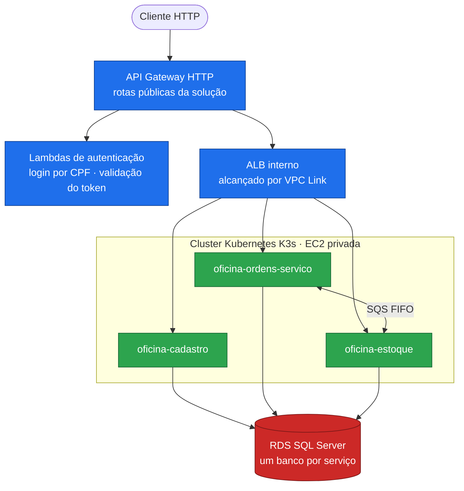
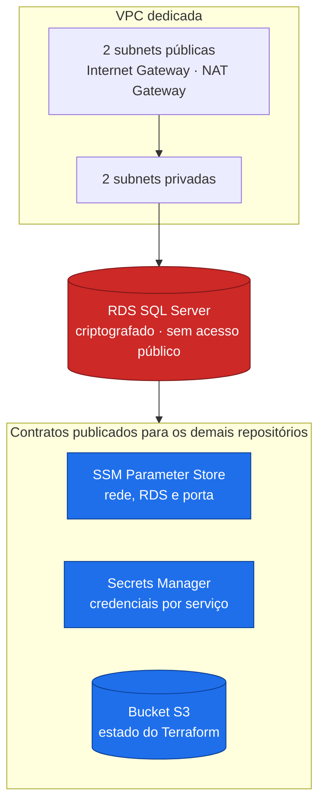
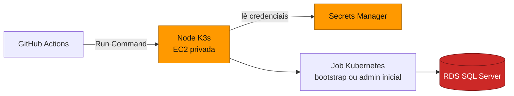

<h1 align="center">Oficina · Infraestrutura de Dados</h1>

<p align="center">
  Fundação da solução <strong>Oficina</strong>: rede privada, banco de dados relacional,
  segredos de acesso e o estado remoto do Terraform compartilhado por todos os repositórios.
</p>

<p align="center">
  
  
  
  
  
</p>

---

## Sumário

- [Responsabilidade](#responsabilidade)
- [Solução integrada](#solução-integrada)
- [Ordem de deploy](#ordem-de-deploy)
- [Arquitetura](#arquitetura)
- [Pré-requisitos manuais](#pré-requisitos-manuais)
- [Contratos consumidos e publicados](#contratos-consumidos-e-publicados)
- [Como configurar](#como-configurar)
- [Como executar](#como-executar)
- [Como validar](#como-validar)
- [Validação local](#validação-local)
- [Próxima etapa](#próxima-etapa)

---

## Responsabilidade

Este repositório é a raiz do grafo de dependências da solução. Nada é implantado antes dele.

| Entrega | Etapa | Conteúdo |
|---|:---:|---|
| Infraestrutura de dados | **1** | Bucket S3 de estado do Terraform, VPC com subnets públicas e privadas, RDS SQL Server privado e os contêineres de segredo das credenciais de banco |
| Estrutura dos bancos | **3** | Bancos, logins, usuários e permissões, aplicados por um Job Kubernetes idempotente |
| Administrador inicial | **6** | Única linha de funcionário administrador em `OficinaCadastroDb`, usada para autenticar na validação funcional |

---

## Solução integrada

A **Oficina** é uma plataforma de gestão de oficina mecânica implantada na AWS e distribuída em **6 repositórios que formam um único sistema**. O cliente acessa uma **API Gateway HTTP**, autenticada na borda por **Lambdas**; o tráfego segue por **VPC Link** até um **ALB interno**, que roteia para três microsserviços **.NET 10** em **Kubernetes (K3s)**. Os serviços conversam por HTTP interno e por **filas SQS FIFO**, e persistem em um **RDS SQL Server** com um banco isolado por serviço.


```mermaid
flowchart TB
    Cliente([Cliente HTTP])
    Gateway["API Gateway HTTP<br/>rotas públicas da solução"]
    Auth["Lambdas de autenticação<br/>login por CPF · validação do token"]
    ALB["ALB interno<br/>alcançado por VPC Link"]

    subgraph Cluster["Cluster Kubernetes K3s · EC2 privada"]
        direction LR
        Cadastro["oficina-cadastro"]
        Ordens["oficina-ordens-servico"]
        Estoque["oficina-estoque"]
    end

    Banco[("RDS SQL Server<br/>um banco por serviço")]

    Cliente --> Gateway
    Gateway --> Auth
    Gateway --> ALB
    ALB --> Cadastro
    ALB --> Ordens
    ALB --> Estoque
    Ordens <-->|"SQS FIFO"| Estoque
    Cadastro --> Banco
    Ordens --> Banco
    Estoque --> Banco

    classDef borda fill:#1f6feb,stroke:#0b3d91,color:#fff
    classDef servico fill:#2da44e,stroke:#166534,color:#fff
    classDef dados fill:#CC2927,stroke:#7a1717,color:#fff
    class Gateway,Auth,ALB borda
    class Cadastro,Ordens,Estoque servico
    class Banco dados
```

| Repositório | Responsabilidade | Etapas |
|---|---|:---:|
| **oficina-infra-db** *(este)* | Rede, banco de dados, segredos, estado do Terraform e administrador inicial | 1 · 3 · 6 |
| [oficina-infra](https://github.com/fabianorodrigues/oficina-infra-fiap-fase4) | Plataforma Kubernetes/ALB, entrada pública da API e observabilidade | 2 · 9 · 10 |
| [oficina-auth-lambda](https://github.com/fabianorodrigues/oficina-auth-lambda-fiap-fase4) | Autenticação por CPF e validação de token na borda | 4 |
| [oficina-cadastro](https://github.com/fabianorodrigues/oficina-cadastro-fiap-fase4) | Clientes, veículos, funcionários e catálogo de serviços | 5 |
| [oficina-estoque](https://github.com/fabianorodrigues/oficina-estoque-fiap-fase4) | Peças, insumos, saldos e reservas | 7 |
| [oficina-ordens-servico](https://github.com/fabianorodrigues/oficina-ordens-servico-fiap-fase4) | Ordens de serviço, orçamento e saga de pagamento | 8 · 11 |

O acoplamento entre repositórios é feito **por nome de parâmetro no SSM e de segredo no Secrets Manager**. Não há leitura de estado entre stacks: cada etapa lê apenas o que a anterior publicou.

---

## Ordem de deploy

Cada workflow valida suas precondições e falha quando a etapa anterior não está concluída.

| # | Repositório | Workflow | Confirmação |
|:---:|---|---|:---:|
| **1** | **oficina-infra-db** *(este)* | **Database Infrastructure Deploy** | `APPLY` |
| 2 | oficina-infra | Platform Deploy | `APPLY` |
| **3** | **oficina-infra-db** *(este)* | **Database Bootstrap** | `BOOTSTRAP` |
| 4 | oficina-auth-lambda | Auth Deploy | `DEPLOY` |
| 5 | oficina-cadastro | Cadastro Deploy | `DEPLOY` |
| **6** | **oficina-infra-db** *(este)* | **Initial Admin Provision** | `PROVISION_ADMIN` |
| 7 | oficina-estoque | Estoque Deploy | `DEPLOY` |
| 8 | oficina-ordens-servico | Ordens Deploy | `DEPLOY` |
| 9 | oficina-infra | Entrypoint Deploy | `APPLY` |
| 10 | oficina-infra | Observability Deploy | `DEPLOY` |
| 11 | oficina-ordens-servico | Collection Postman (manual) | — |

> [!IMPORTANT]
> Este repositório abre e retoma a sequência. A **etapa 1** cria o bucket de estado usado por todos os stacks. A **etapa 3** roda como Job Kubernetes e por isso só é possível depois do cluster criado na etapa 2. A **etapa 6** depende da tabela de funcionários criada pelas migrations da etapa 5.

---

## Arquitetura

### Etapa 1 — rede, banco e contratos


```mermaid
flowchart TB
    subgraph Rede["VPC dedicada"]
        direction TB
        Publicas["2 subnets públicas<br/>Internet Gateway · NAT Gateway"]
        Privadas["2 subnets privadas"]
        Publicas --> Privadas
    end

    Banco[("RDS SQL Server<br/>criptografado · sem acesso público")]

    subgraph Contratos["Contratos publicados para os demais repositórios"]
        direction LR
        SSM["SSM Parameter Store<br/>rede, RDS e porta"]
        SM["Secrets Manager<br/>credenciais por serviço"]
        S3[("Bucket S3<br/>estado do Terraform")]
    end

    Privadas --> Banco
    Banco --> Contratos

    classDef dados fill:#CC2927,stroke:#7a1717,color:#fff
    classDef contrato fill:#1f6feb,stroke:#0b3d91,color:#fff
    class Banco dados
    class SSM,SM,S3 contrato
```

### Etapas 3 e 6 — Jobs de banco

Os dois workflows seguem o mesmo caminho: o runner nunca toca em valor secreto. As credenciais são lidas do Secrets Manager **dentro da EC2** e materializadas como Secret Kubernetes temporário, removido em bloco `finally` que roda em sucesso, falha e timeout.


```mermaid
flowchart LR
    Workflow["GitHub Actions"] -->|"Run Command"| Node["Node K3s<br/>EC2 privada"]
    Node -->|"lê credenciais"| SM["Secrets Manager"]
    Node --> Job["Job Kubernetes<br/>bootstrap ou admin inicial"]
    Job --> Banco[("RDS SQL Server")]

    classDef dados fill:#CC2927,stroke:#7a1717,color:#fff
    classDef infra fill:#FF9900,stroke:#b36b00,color:#111
    class Banco dados
    class Node,SM infra
```

### Matriz de bancos e logins

Criada pela etapa 3 e validada por um job de isolamento que confirma que nenhum login acessa o banco de outro serviço.

| Banco | Login de runtime | Login de migração | Somente leitura |
|---|---|---|---|
| `OficinaCadastroDb` | `cadastro_app` | `cadastro_migrator` | `auth_read` |
| `OficinaEstoqueDb` | `estoque_app` | `estoque_migrator` | — |
| `OficinaOrdensServicoDb` | `ordens_app` | `ordens_migrator` | — |

O login `auth_read` permite que a autenticação consulte a tabela de funcionários sem qualquer permissão de escrita.

---

## Pré-requisitos manuais

Itens que **não são provisionados** por nenhum workflow da solução e precisam existir antes da execução.

| Pré-requisito | Onde configurar | Por que é manual |
|---|---|---|
| Credenciais temporárias da AWS | Secrets deste repositório | Não há federação OIDC; o par de chaves e o token de sessão são fornecidos pelo ambiente |
| Senhas dos 7 logins de banco | Secrets deste repositório | Definidas por quem opera o ambiente e gravadas no Secrets Manager pelo próprio deploy |
| Credenciais do administrador inicial | Secrets deste repositório | Identidade escolhida por quem opera o ambiente |
| Imagem base com as ferramentas de linha de comando do SQL Server | Variable `SQL_TOOLS_IMAGE` | A imagem oficial exige tag ou digest explícito; nenhum workflow escolhe versão por você |
| Instance profile da EC2 do cluster | Variable `INSTANCE_PROFILE_NAME`, em [oficina-infra](https://github.com/fabianorodrigues/oficina-infra-fiap-fase4#pré-requisitos-manuais) | Nenhum workflow da solução cria ou altera recursos IAM |

Os Jobs das etapas 3 e 6 herdam a role do instance profile da EC2. Essa role precisa permitir, no mínimo:

| Necessidade | Permissões |
|---|---|
| Execução por Systems Manager | Registro do agente e recebimento de Run Command |
| Download das imagens | `ecr:GetAuthorizationToken` e leitura do repositório `db-bootstrap` |
| Leitura de credenciais | `secretsmanager:GetSecretValue` no segredo master do RDS e nos 7 segredos de banco |
| Hash temporário do administrador | `ssm:GetParameter` com `kms:Decrypt` no prefixo `/oficina/deploy/` |

Verifique um instance profile existente e a role associada:

```bash
aws iam get-instance-profile --instance-profile-name "<nome-do-instance-profile>" \
  --query 'InstanceProfile.Roles[].RoleName' --output text
```

> [!NOTE]
> O runner do GitHub também precisa de `ssm:PutParameter`, `ssm:GetParameter` e `ssm:DeleteParameter` para a etapa 6. O workflow simula a política antes de criar qualquer parâmetro e aborta com mensagem explícita se alguma permissão faltar.

---

## Contratos consumidos e publicados

### Consome

Nada na etapa 1. As etapas 3 e 6 consomem o node do cluster, o namespace e o repositório de imagem `db-bootstrap`, publicados por `oficina-infra` na etapa 2.

### Publica

| Recurso | Caminho | Consumido por |
|---|---|---|
| VPC | `/oficina/infra/vpc/id` | infra · auth |
| Subnets privadas | `/oficina/infra/subnets/private/{1,2}` | infra · auth |
| Subnets públicas | `/oficina/infra/subnets/public/{1,2}` | infra |
| RDS | `/oficina/infra/rds/{identifier,endpoint,port}` | bootstrap |
| Grupo de segurança do RDS | `/oficina/infra/rds/security-group-id` | infra · auth |
| Segredo master do RDS | `/oficina/infra/rds/master-secret-arn` | bootstrap |
| Credenciais dos serviços | `/oficina/{cadastro,estoque,ordens}/{runtime,migration}-db` | cadastro · estoque · ordens |
| Credencial de leitura da autenticação | `/oficina/auth/database` | auth |
| Estado do Terraform | Bucket S3 `oficina-terraform-state-<conta>-<região>` | todos os stacks |

---

## Como configurar

Configure em **Settings → Secrets and variables → Actions** deste repositório.

### Secrets

| Secret | Uso | Obrigatório |
|---|---|:---:|
| `AWS_ACCESS_KEY_ID` · `AWS_SECRET_ACCESS_KEY` · `AWS_SESSION_TOKEN` | Credenciais temporárias da AWS | **Sim** |
| `SQL_CADASTRO_APP_PASSWORD` · `SQL_CADASTRO_MIGRATOR_PASSWORD` | Logins do banco de cadastro | **Sim** |
| `SQL_ESTOQUE_APP_PASSWORD` · `SQL_ESTOQUE_MIGRATOR_PASSWORD` | Logins do banco de estoque | **Sim** |
| `SQL_ORDENS_APP_PASSWORD` · `SQL_ORDENS_MIGRATOR_PASSWORD` | Logins do banco de ordens | **Sim** |
| `SQL_AUTH_READ_PASSWORD` | Login de leitura da autenticação | **Sim** |
| `ADMIN_INICIAL_CPF` · `ADMIN_INICIAL_PASSWORD` | Identidade do administrador inicial | **Sim, na etapa 6** |
| `RDS_ADMIN_CIDR` | CIDR IPv4 `/32` autorizado a acessar a porta do SQL Server para administração. Vazio mantém o banco fechado | Não |

As 7 senhas são verificadas antes do plano; o deploy falha listando as que faltarem. Use senhas que atendam à política do SQL Server: maiúscula, minúscula, dígito e no mínimo 8 caracteres.

O `ADMIN_INICIAL_CPF` precisa ter exatamente 11 dígitos sem pontuação e dígitos verificadores válidos; `ADMIN_INICIAL_PASSWORD` aceita até 256 caracteres. Ambos são validados antes de qualquer escrita.

### Variables

| Variable | Uso | Obrigatório |
|---|---|:---:|
| `AWS_REGION` | Região de todos os recursos | **Sim** |
| `SQL_TOOLS_IMAGE` | Imagem base das ferramentas de linha de comando do SQL Server. Exige tag ou digest explícito — `latest` é rejeitado | **Sim, nas etapas 3 e 6** |
| `TF_STATE_BUCKET` | Compatibilidade com um bucket de estado pré-existente com outro nome | Não |

### O que é provisionado automaticamente

O bucket de estado é criado e reconciliado pelo próprio workflow, e **todas as variáveis do Terraform têm valor padrão**. Não é necessário criar rede, banco, segredo ou parâmetro manualmente.

> [!WARNING]
> O CIDR da VPC, a engine, a classe de instância e o armazenamento do RDS são fixos no código Terraform. Alterá-los exige editar `terraform/infra-db/variables.tf` e abrir um pull request. `RDS_ADMIN_CIDR` não altera a rede: apenas adiciona uma exceção de entrada no grupo de segurança do banco.

---

## Como executar

Os três workflows rodam apenas na branch `main` e exigem confirmação **sensível a maiúsculas**.

### Etapa 1 — Database Infrastructure Deploy

**Actions → Database Infrastructure Deploy → Run workflow → `confirmation` = `APPLY`**

Cria e reconcilia o bucket de estado, valida o plano, aplica rede, RDS e contêineres de segredo, grava as 7 senhas no Secrets Manager e revalida. Um passo de segurança **interrompe o deploy se o plano previr exclusão** de VPC, subnet, instância de banco, segredo ou parâmetro.

Duração típica: 15 a 25 minutos, dominada pela criação do RDS.

### Etapa 3 — Database Bootstrap

Execute **apenas depois** do Platform Deploy (etapa 2).

**Actions → Database Bootstrap → Run workflow → `confirmation` = `BOOTSTRAP`**

Constrói a imagem de bootstrap a partir de `SQL_TOOLS_IMAGE`, publica no ECR, executa o Job Kubernetes que cria bancos, logins e permissões, e encerra com o job de isolamento. É idempotente: reexecutar não duplica objetos.

Neste momento a tabela de funcionários ainda não existe — ela é criada pelas migrations do Cadastro na etapa 5.

<a id="etapa-6"></a>

### Etapa 6 — Initial Admin Provision

Execute **apenas depois** do Cadastro Deploy (etapa 5).

**Actions → Initial Admin Provision → Run workflow → `confirmation` = `PROVISION_ADMIN`**

Deriva o hash PBKDF2 da senha no runner, envia apenas o hash como parâmetro `SecureString` temporário e executa um Job restrito a uma única linha na tabela de funcionários. A senha em texto claro nunca sai do runner e o parâmetro temporário é removido ao final.

Se o administrador já existir, o Job atualiza nome, hash, perfil e situação — o workflow serve tanto para criar quanto para rotacionar a credencial.

> [!IMPORTANT]
> Esta etapa é obrigatória no primeiro provisionamento do ambiente e opcional em redeploys posteriores. Sem ela não há credencial para autenticar na validação funcional da etapa 11.

---

## Como validar

### Pelo Console AWS

| Serviço | O que verificar |
|---|---|
| **VPC** | 1 VPC, 4 subnets, 1 Internet Gateway e 1 NAT Gateway |
| **RDS** | Instância `Available`, **Publicly accessible = No** e criptografia habilitada |
| **Secrets Manager** | 7 segredos, cada um com uma versão `AWSCURRENT` |
| **Parameter Store** | Parâmetros de rede e RDS sob `/oficina/infra/` |
| **S3** | Bucket de estado com versionamento e criptografia ativos |
| **Systems Manager → Run Command** | Após as etapas 3 e 6, comandos com status `Success` |

### Pela AWS CLI

<details>
<summary>Comandos de validação</summary>

```bash
REGIAO=<sua-regiao>

# Parâmetros publicados para os demais repositórios
aws ssm get-parameters-by-path --path /oficina/infra --recursive \
  --region "$REGIAO" --query 'Parameters[].Name' --output table

# RDS disponível e fechado para a internet
aws rds describe-db-instances --region "$REGIAO" \
  --query 'DBInstances[].{Status:DBInstanceStatus,Publico:PubliclyAccessible,Cripto:StorageEncrypted}' \
  --output table

# Cada segredo precisa ter exatamente uma versão corrente
for s in cadastro/runtime-db cadastro/migration-db estoque/runtime-db \
         estoque/migration-db ordens/runtime-db ordens/migration-db auth/database; do
  echo -n "/oficina/$s -> "
  aws secretsmanager describe-secret --secret-id "/oficina/$s" \
    --region "$REGIAO" --query 'length(VersionIdsToStages)' --output text
done
```

</details>

O resumo de cada execução lista bancos, logins e permissões aplicados, sem expor credenciais.

---

## Validação local

A infraestrutura só é alterada pelos workflows, para manter o estado do Terraform consistente. Localmente é possível reproduzir a validação estática executada pela CI:

```bash
cd terraform/infra-db
terraform fmt -check -recursive
terraform init -backend=false
terraform validate
```

---

## Próxima etapa

**Etapa 2 — obrigatória.** Pré-condição: bucket S3 de estado criado, VPC ativa e RDS `Available`.

**→ [oficina-infra](https://github.com/fabianorodrigues/oficina-infra-fiap-fase4#etapa-2--platform-deploy)** — provisiona a EC2 com K3s, o ALB interno, os repositórios de imagem e as filas.

Depois da etapa 2, retorne a [Etapa 3 — Database Bootstrap](#etapa-3--database-bootstrap). Depois da etapa 5, retorne a [Etapa 6 — Initial Admin Provision](#etapa-6).
